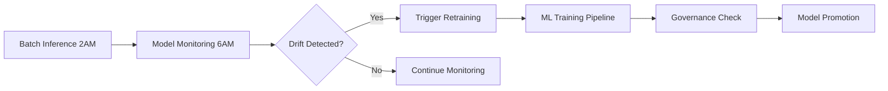

# Healthcare Insurance MLOps - Databricks Asset Bundles Implementation Summary

## ✅ Complete Implementation Status

The Healthcare Insurance MLOps project has been successfully converted to use Databricks Asset Bundles (DABs) following MLOps best practices. All components are now ready for deployment and orchestration.

## 📁 Project Structure

```
healthcare-insurance-mlops/
├── databricks.yml                     # Main bundle configuration
├── resources/                         # Resource definitions
│   ├── clusters.yml                  # Cluster configurations  
│   └── experiments.yml               # MLflow experiments
├── deployment/
│   └── deploy.sh                     # Automated deployment script
├── src/healthcare_mlops/             # Python package
│   ├── __init__.py
│   └── governance.py                 # Model governance CLI
├── utils/                            # Utility notebooks
│   ├── data_validation.ipynb         # Data validation
│   └── inference_validation.ipynb    # Inference validation
├── 00-training/                      # ML training notebooks
├── 01-governance/                    # Governance scripts  
├── 02-batch/                         # Batch inference
├── 03-monitoring/                    # Model monitoring
├── setup.py                         # Python package setup
├── DEPLOYMENT.md                     # Deployment guide
├── MODEL.md                          # Model documentation
└── CLAUDE.md                         # Development guide
```

## 🚀 Deployed Resources

### Jobs and Workflows
1. **Feature Engineering Job** - Automated feature creation and feature store management
2. **Model Training Job** - Random Forest/Gradient Boosting training with MLflow
3. **Model Governance Job** - Healthcare-specific validation and promotion (using Python CLI)
4. **Batch Inference Job** - Daily patient scoring with business logic (scheduled 2 AM)
5. **Model Monitoring Job** - Drift detection and performance monitoring (scheduled 6 AM)
6. **ML Training Pipeline** - End-to-end orchestrated workflow with proper dependencies

### Infrastructure Resources
- **Development Cluster** - Interactive development environment
- **Inference Cluster** - Scalable batch processing cluster
- **MLflow Experiments** - Organized by component (feature engineering, training, governance, monitoring)
- **Model Serving Endpoints** - Real-time inference capabilities

### Environment Configuration
- **Development** - Single-node clusters for testing and development
- **Staging** - Scaled resources for pre-production validation
- **Production** - High-availability configuration with monitoring

## 🔧 Key Features Implemented

### Healthcare Compliance
- **HIPAA Compliance** - All data processing follows deidentification standards
- **Clinical Validation** - BMI categorization, age risk scoring, smoking impact factors
- **Governance Automation** - Automated model validation against healthcare industry standards
- **Audit Trails** - Complete lineage tracking through Unity Catalog

### MLOps Best Practices
- **Environment Separation** - Dev/Staging/Prod with appropriate configurations
- **Dependency Management** - Proper task sequencing and workflow orchestration
- **Resource Optimization** - Environment-specific cluster sizing and autotermination
- **Monitoring Integration** - Comprehensive drift detection and performance alerts

### Business Logic
- **Risk Categorization** - Low/Medium/High/Critical risk classification
- **Business Rules** - Minimum risk thresholds, confidence intervals, review flags
- **Healthcare Metrics** - High-risk patient identification, demographic fairness monitoring
- **Performance Targets** - R² ≥ 0.70, MAE ≤ 15.0, High-Risk Accuracy ≥ 60%

## 📊 Governance and Validation

### Model Promotion Criteria
```yaml
Healthcare Requirements:
  - R² Score: ≥ 0.70
  - Mean Absolute Error: ≤ 15.0 (for risk scores)
  - High-Risk Accuracy: ≥ 60%
  - HIPAA Compliance: Required
  - Bias Testing: Automated
```

### Monitoring Thresholds
```yaml
Alert Conditions:
  - High MAE: > 15.0 triggers retraining alert
  - Low Volume: < 50 daily predictions triggers pipeline check
  - Drift Alert: Composite drift score > 0.3 triggers investigation
  - Demographic Bias: > 10% shift triggers review
```

## 🎯 Deployment Instructions

### Prerequisites
1. **Databricks CLI** installed and configured
2. **Unity Catalog Access** with appropriate permissions
3. **Data Prerequisites** - silver_patients and dim_patients tables must exist

### Quick Start
```bash
# 1. Update configuration (workspace URLs, emails)
# Edit databricks.yml

# 2. Validate bundle
databricks bundle validate --target dev

# 3. Deploy to development
./deployment/deploy.sh -e dev

# 4. Run ML pipeline
databricks jobs run-now --job-name "[dev] Healthcare ML Training Pipeline"
```

### Environment Promotion
```bash
# Deploy to staging
./deployment/deploy.sh -e staging

# Deploy to production  
./deployment/deploy.sh -e prod
```

## 🔍 Validation Steps

After deployment, verify the following:

### 1. Resource Creation
```bash
# Check jobs were created
databricks jobs list --output table

# Verify experiments exist
databricks experiments list

# Check model registry
databricks models list
```

### 2. Job Execution
- Monitor feature engineering job completion
- Verify model training and registration
- Confirm governance validation passes
- Check batch inference produces predictions
- Validate monitoring setup creates views

### 3. Model Endpoints
- Verify model serving endpoint deployment
- Test real-time inference capabilities
- Monitor endpoint performance and scaling

## 📈 Operational Workflows

### Daily Operations


### Weekly Operations
- Review job execution logs
- Monitor model performance metrics
- Update governance thresholds if needed
- Review demographic fairness reports

### Monthly Operations
- Refresh training data
- Update dependencies
- Review and optimize cluster configurations
- Plan capacity and scaling adjustments

## 🛡️ Security and Compliance

### Access Control
- **Service Principals** for production workloads
- **Role-Based Access** for different teams
- **Least Privilege** access controls
- **Token Rotation** procedures documented

### Data Governance
- **Unity Catalog** centralized permissions
- **Schema-Level** access controls
- **Data Classification** for HIPAA compliance
- **Audit Logging** for compliance reporting

## 🔄 CI/CD Integration

The bundle is ready for integration with:
- **GitHub Actions** - Automated deployment on code changes
- **Azure DevOps** - Enterprise CI/CD pipelines
- **Databricks Workflows** - Native orchestration capabilities
- **Custom Automation** - API-driven deployment processes

## 📚 Documentation

- **MODEL.md** - Comprehensive model documentation for data science team
- **DEPLOYMENT.md** - Detailed deployment and operational guide
- **CLAUDE.md** - Development guidance for future Claude instances
- **DAB_IMPLEMENTATION_SUMMARY.md** - This summary document

## ✅ Ready for Production

The Healthcare Insurance MLOps project is now fully implemented with Databricks Asset Bundles and ready for:

1. ✅ **Development** - Interactive development and testing
2. ✅ **Staging** - Pre-production validation and testing
3. ✅ **Production** - Enterprise-grade deployment with monitoring
4. ✅ **Compliance** - HIPAA-ready with healthcare industry standards
5. ✅ **Monitoring** - Comprehensive drift detection and alerting
6. ✅ **Governance** - Automated model validation and promotion

The implementation follows Databricks MLOps best practices and provides a robust, scalable, and compliant healthcare ML platform.