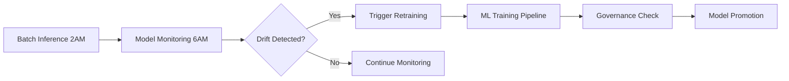

# Healthcare Insurance MLOps Project

This project implements a comprehensive machine learning pipeline for predicting healthcare insurance costs using MLOps best practices on Databricks. It is designed for production-readiness, with a focus on governance, compliance, and scalability.

## Business Use Cases

1.  **Cost Prediction**: Predict healthcare insurance costs for new customers.
2.  **Risk Assessment**: Identify high-risk patients requiring intervention.
3.  **Pricing Strategy**: Develop regional and demographic-based pricing models.
4.  **Healthcare Analytics**: Gain insights into population health trends.

## Architecture & Components

The project is structured around a modern MLOps architecture using Databricks Asset Bundles (DABs) for orchestration.

### Project Structure

```
healthcare-insurance-mlops/
├── databricks.yml                     # Main bundle configuration
├── resources/                         # Resource definitions
│   └── experiments.yml               # MLflow experiments
├── 00-training/                       # ML training notebooks
│   ├── 00-insurance-model-feature.ipynb
│   └── 01-insurance-model-train.ipynb
├── 01-governance/                     # Governance scripts
│   └── insurance-model-governance.py
├── 02-batch/                          # Batch inference
│   └── insurance-model-batch.ipynb
├── 03-monitoring/                     # Model monitoring
│   └── insurance-model-monitor.ipynb
├── 99-eda/                           # Exploratory data analysis
├── utils/                            # Utility notebooks
│   ├── data_validation.ipynb
│   └── inference_validation.ipynb
└── README.md                        # This file
```

### Core Components

*   **Feature Engineering** (`00-training/00-insurance-model-feature.ipynb`):
    *   **Feature Store**: Creates and manages advanced healthcare risk features (e.g., BMI categorization, age risk scoring, smoking impact) and stores them in Unity Catalog.
*   **Model Training & MLflow Integration** (`00-training/01-insurance-model-train.ipynb`):
    *   **Training Pipeline**: Trains models (Random Forest, Gradient Boosting) with healthcare-specific metrics and cross-validation, tracked with MLflow.
    *   **Model Registry**: Models are versioned and stored in Unity Catalog.
*   **Model Governance** (`01-governance/insurance-model-governance.py`):
    *   **Governance Framework**: A Python script for validating models against healthcare compliance and performance thresholds, with automated promotion.
*   **Batch Inference** (`02-batch/insurance-model-batch.ipynb`):
    *   **Batch Scoring**: Optimized for large-scale processing, with automated feature lookup and risk categorization.
*   **Model Monitoring** (`03-monitoring/insurance-model-monitor.ipynb`):
    *   **Drift Detection**: Monitors for data and prediction drift with automated alerting.

## Key Features

### Healthcare-Specific Capabilities

*   **HIPAA Compliance**: Synthetic data generation and privacy controls.
*   **Clinical Validation**: Features aligned with clinical standards (BMI categories, age risk scores).
*   **Business Logic**: Identification of high-cost patients (95th percentile) and composite health risk scoring.

### Technical Features

*   **Unity Catalog**: Centralized governance for data, features, and models.
*   **Databricks Asset Bundles**: Infrastructure-as-code for managing Databricks resources.
*   **MLflow**: End-to-end tracking of the machine learning lifecycle.
*   **Environment Separation**: Pre-configured for `dev`, `staging`, and `prod` environments.

## Deployment Guide

### Prerequisites

1.  **Databricks CLI**: Ensure the Databricks CLI is installed and configured.
    ```bash
    pip install databricks-cli
    databricks configure --token
    ```
2.  **Unity Catalog Access**: You need permissions to create schemas, tables, and models in the target catalog.
3.  **Data Prerequisites**: The following tables must exist with data:
    *   `juan_dev.healthcare_data.silver_patients`
    *   `juan_dev.healthcare_data.dim_patients`

### Deployment Steps

1.  **Update Configuration**: Edit `databricks.yml` to set your workspace host and notification email addresses.
2.  **Validate Bundle**:
    ```bash
    databricks bundle validate --target dev
    ```
3.  **Deploy Resources**:
    ```bash
    databricks bundle deploy --target dev
    ```
4.  **Run the ML Pipeline**:
    ```bash
    databricks jobs run-now --job-name "[dev] Healthcare ML Training Pipeline"
    ```

### Environment Promotion

To deploy to staging or production, use the respective target names:

```bash
# Deploy to staging
databricks bundle deploy --target staging

# Deploy to production
databricks bundle deploy --target prod
```

## Governance and Monitoring

### Model Promotion Criteria

| Metric                | Threshold     |
| --------------------- | ------------- |
| R² Score              | ≥ 0.70        |
| Mean Absolute Error   | ≤ 15.0        |
| High-Risk Accuracy    | ≥ 60%         |
| HIPAA Compliance      | Required      |

### Monitoring and Alerting

*   **Drift Detection**: Monitors for statistical drift in predictions and demographic shifts in data.
*   **Performance Monitoring**: Tracks key metrics like MAE and R².
*   **Alerts**: Configured to trigger on events like high MAE, low prediction volume, or significant drift.

## Operational Workflows



## CI/CD Integration

The project is ready for CI/CD integration. Here is an example for GitHub Actions:

```yaml
name: Deploy Healthcare MLOps
on:
  push:
    branches: [main]

jobs:
  deploy:
    runs-on: ubuntu-latest
    steps:
    - uses: actions/checkout@v2
    - uses: databricks/setup-cli@main
    - name: Deploy to staging
      run: databricks bundle deploy --target staging
      env:
        DATABRICKS_TOKEN: ${{ secrets.DATABRICKS_TOKEN }}
        DATABRICKS_HOST: ${{ secrets.DATABRICKS_HOST }}
```

## Deployed Resources

### Jobs and Workflows

1. **Feature Engineering Job** - Automated feature creation and feature store management
2. **Model Training Job** - Random Forest/Gradient Boosting training with MLflow
3. **Model Governance Job** - Healthcare-specific validation and promotion (using Python CLI)
4. **Batch Inference Job** - Daily patient scoring with business logic (scheduled 2 AM)
5. **Model Monitoring Job** - Drift detection and performance monitoring (scheduled 6 AM)
6. **ML Training Pipeline** - End-to-end orchestrated workflow with proper dependencies

### Infrastructure Resources

- **Development Cluster** - Interactive development environment (single-node)
- **Inference Cluster** - Scalable batch processing cluster (multi-node)
- **MLflow Experiments** - Organized by component (feature engineering, training, governance, monitoring)
- **Model Serving Endpoints** - Real-time inference capabilities (configurable)

## Job Execution Flow

### ML Training Pipeline

1. **Feature Engineering** → Creates features in feature store
2. **Model Training** → Trains and logs model to MLflow
3. **Model Governance** → Validates model against healthcare criteria
4. **Batch Inference Validation** → Tests model on sample data
5. **Setup Monitoring** → Initializes drift detection and alerts

### Daily Operations

1. **Batch Inference** (2 AM daily) → Scores new patients
2. **Model Monitoring** (6 AM daily) → Checks for drift and performance issues
3. **Automated Retraining** → Triggered if monitoring detects issues

## Healthcare Compliance

### HIPAA Compliance

- All data processing follows deidentification standards
- Models tagged with compliance status
- Audit trails maintained through Unity Catalog

### Clinical Validation

- BMI categorization uses clinical standards
- Age risk scoring follows actuarial practices
- Smoking impact factors based on healthcare evidence

### Governance Requirements

- Automated bias testing for demographic groups
- Performance validation against industry standards
- Champion/challenger pattern for safe model updates

## Advanced Configuration

### Environment-Specific Settings

- **Development**: Single-node clusters for testing and development
- **Staging**: Scaled resources for pre-production validation
- **Production**: High-availability configuration with monitoring

### Monitoring Thresholds

| Alert Condition    | Threshold | Action                    |
| ------------------ | --------- | ------------------------- |
| High MAE           | > 15.0    | Triggers retraining alert |
| Low Volume         | < 50      | Triggers pipeline check   |
| Drift Alert        | > 0.3     | Triggers investigation    |
| Demographic Bias   | > 10%     | Triggers review           |

## Troubleshooting

### Common Issues

#### 1. Authentication Errors

```bash
# Set up authentication
databricks configure --token
# Or set environment variables
export DATABRICKS_HOST="https://your-workspace.cloud.databricks.com"
export DATABRICKS_TOKEN="your-personal-access-token"
```

#### 2. Missing Tables

```sql
-- Verify prerequisite tables exist
SHOW TABLES IN juan_dev.healthcare_data LIKE '*patient*';
```

#### 3. Permission Issues

- Ensure Unity Catalog permissions for schemas
- Verify service principal has necessary privileges
- Check workspace admin permissions for job creation

#### 4. Job Failures

```bash
# Check job run details
databricks jobs list
databricks jobs get-run --run-id <run-id>
```

### Validation Commands

```bash
# Validate bundle without deploying
databricks bundle validate --target dev

# List deployed resources
databricks jobs list --output table

# Check model registry
databricks models list --output table
```

## Best Practices

### Development Workflow

1. **Feature Development**: Test in development environment first
2. **Code Review**: Use pull requests for all changes
3. **Environment Promotion**: Dev → Staging → Production
4. **Monitoring**: Set up alerts before production deployment

### Resource Management

- Use appropriate cluster sizes for workloads
- Enable autotermination to control costs
- Tag resources for cost tracking and management
- Use spot instances for development clusters

### Security

- Use service principals for production workloads
- Implement least-privilege access controls
- Regularly rotate access tokens and credentials
- Monitor access logs and usage patterns

### Model Lifecycle

- Maintain model versioning through MLflow
- Document model changes and performance impacts
- Test governance checks in lower environments
- Plan rollback procedures for model updates

## Support and Maintenance

### Regular Tasks

- Review job execution logs weekly
- Monitor model performance metrics daily
- Update dependencies quarterly
- Refresh training data monthly
- Review and update governance thresholds as needed

### Scaling Considerations

- Monitor cluster utilization and adjust sizes
- Consider multi-region deployment for high availability
- Implement data archiving for historical predictions
- Plan for increased data volumes and model complexity

## Additional Resources

- [Databricks Asset Bundles Documentation](https://docs.databricks.com/dev-tools/bundles/)
- [MLflow Model Registry](https://mlflow.org/docs/latest/model-registry.html)
- [Unity Catalog Best Practices](https://docs.databricks.com/data-governance/unity-catalog/best-practices.html)
- **MODEL.md** - Comprehensive model documentation for data science team
- **CLAUDE.md** - Development guidance for future Claude instances
